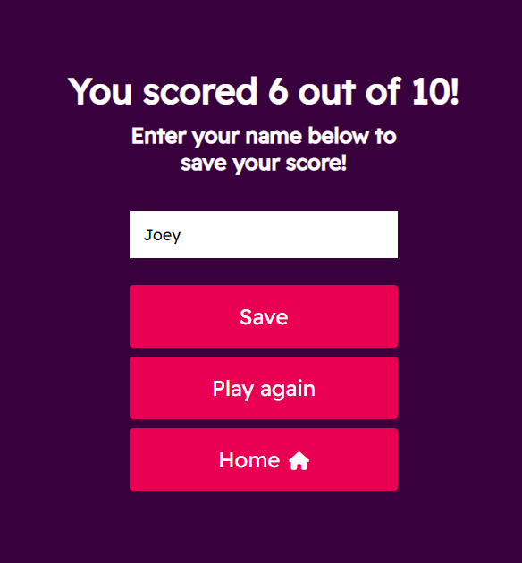
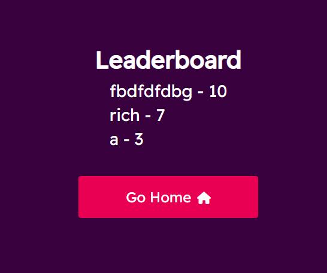
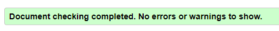
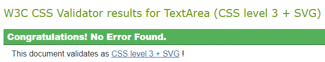
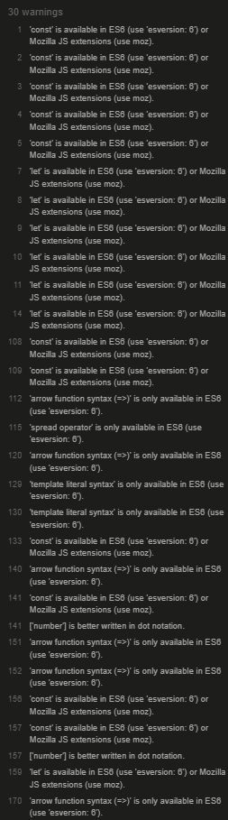
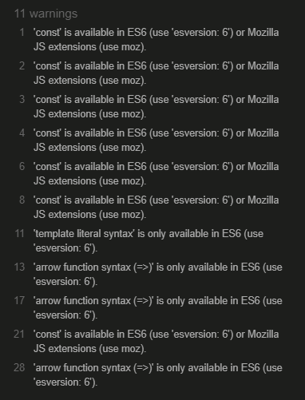
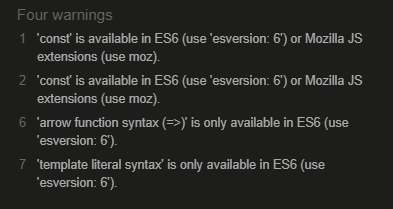
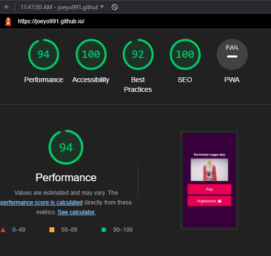

# **_Premier Leage Quiz_**

The premier League quiz is a quiz I made for people who share my passion for football, and the Premier League in particular. The quiz is easy to use and fun.

Welcome to the process behind <a href="https://joeyo991.github.io/" target="_blank" rel="noopener">The Premier League Quiz</a>

# User Experience

## Site Structure

The Premier League Quiz website is a single page with a quiz in the shape of a form for the user to complete.

## Design Choices

 * ### Typography
     The chosen font for the page was 'Readex Pro'. This font was chosen because it is easy to read, it is stylish, and because it is very similar to the official Premier League font.

 * ### Colour Scheme
     The colour scheme chosen for the page was based on the Official Premier League colour scheme for the 2021/2022 season. It features white, a pink (Amaranth) and a purple (Russian Violet).

# Features

The Premier League Quiz is set up to be striking and easy on the eyes. It is immediately recognizable to football fans because of the colours and fonts used throughout.

## Existing Features
* ### Home Page

    * The first page of the site is the Home Page.
    * The text, colours and image let the user know immediately what the page is.
    * The play button allows the user to start the quiz.
    * The Highscores button takes the user to the leaderboard.

* ### The Quiz
    * The quiz is made up of 10 questions with varying difficulty, depending on the user's knowledge of the Premier League.
    * Each question has 4 possible asnwers.
    * Only one of the choices can be picked per question.
    * Each question also has a corresponding image that may or may not be a clue to the answer.
    * Every question appears on its own, and the next question is revealed when the user selects their choice for the current question.
    * If the user selects a correct answer, it will flash green. If they select a wrong answer, it will flash red.

* ### Progress Bar
    * The progress bar is located at the top of the quiz and shows the user what question they are on.
    * It fills as they progress through the quiz.
    * Along side the progress bar is the user's score
    * This lets the user know how many questions they have gotten right so far.

* ### Highscore Submission
    * At the end of the quiz, the player is shown their score and given an option to save their highscore.
    * The player can only save their score if they enter their name.
    * The save button can not be clicked if a name is not given.

* ### Highscores Leaderboard
    * The user can see the 5 best scores on the quiz.
    * The leaderboard is accessibile through the home page.
    * For now, the leaderboard is saved in local storage.

## Future Features

* More Quizzes
  * In the future this page could have a lot more than one quiz.
* Share Results
  * If i were to deploy this site for real in the future I would give the user the option to share their results with friends or on social media.
* Timer
  * I could also add a timer to give the user only a limited time to complete the quiz, like many quiz sites have. I didn't have one here as I wanted the quiz to be fun and I feel a timer can make it stressful.
* Global Leaderboards
  * For now he leaderboard is saved in local storage. In the future I would like for this to be a global leaderboard/

# Technologies Used

* [HTML5](https://html.spec.whatwg.org/) - provides the content and structure for the website.
* [CSS](https://www.w3.org/Style/CSS/Overview.en.html) - provides the styling.
* [JavaScript](https://developer.mozilla.org/en-US/docs/Web/JavaScript) - provides interactivity.
* [Gitpod](https://www.gitpod.io/#get-started) - used to deploy the website.
* [Github](https://github.com/) - used to host and edit the website.

# Testing

## Code Validation
The Premier League Quiz site has been tested thoroughly. All the code has been run through the [W3C HTML Validator](https://validator.w3.org/), the [W3C CSS Validator](https://jigsaw.w3.org/css-validator/) and the [JSHint JavaScript Validator](https://jshint.com/).

### HTML
Each of the four pages: index.html, quiz.html, end.html and highscores.html had 0 errors or mistakes in the HTML code. Each retruned the same result:

### CSS
Each of the three stylesheets: style.css, quiz.css and highscores.css had 0 errors or mistakes in the CSS code. Each returned the same result: 

### JavaScript
Each of the three JavaScript files: quiz.js, end.js and highscores.js had 0 errors in the code. Everything did what I planned for it to do. Each of them had warnings when ran through the JShint validator. I found that these warnings had 0 effect on how my code ran.

Quiz.js:

End.js:

Highscores.js:

## Responsiveness Test
The responsivess design tests were carried out with [Google Chrome Dev Tools](https://developer.chrome.com/docs/devtools/) and a [Responsive Design Checker](http://ami.responsivedesign.is/#)

## Device Testing
The Premier League Quiz site was tested and works on the following devices:
* Moto G4
* Galaxy S5
* iPhone 6/7/8 (Plus)
* iPad / iPad Pro
* Displays < 1200px
* Displays > 1200px

The page fully renders, all images render, there were no broken links, it was fully responsive and the scripts run smoothly.

## Browser Testing
The Premier League Quiz site was tested and works on the following web browsers:
* Google Chrome
* Microsoft Edge
* Mozilla Firefox
* Safari

The site fully renders, all images render, there were no broken links, it was fully responsive and the scripts run smoothly.

## Bugs
There were no bugs when validating any of my code. Any potential bugs, errors or mistakes were found and fixed while in the writing process.

# Additional Testing
The site was also tested using [Google Lighthouse](https://developers.google.com/web/tools/lighthouse) in Chrome Developer Tools to test each of the pages for:

* Performance - How the page performs while loading.
* Accessibility - How accessible is the site.
* Best Practices - The site conforms to industry best practices.
* SEO - Search Engine Optimisation. Is the site optimised for search engine result rankings.

The results for the Premier League Quiz site are below:

# Deployment

## To deploy the project

The site was deployed to GitHub Pages. The steps to deploy a site are as follows:

1. In the GitHub repository, navigate to the **Settings** tab.
2. In Settings, navigate to the **Pages** tab on the left side.
3. Under **Source**, select the branch to main / master, then click save.
4. Once the main branch has been selected, the page will automatically refresh and indicate that the deployment was successful.

The live link to the GitHub repository is - https://github.com/joeyo991/joeyo991.github.io

## To fork the repository on GitHub

A copy of the GitHub Repository can be made by forking the GitHub account. This copy can be viewed and changes can be made to the copy without affecting the original repository. Take the following steps to fork the repository:

1. Log into **GitHub** and locate the [repository](https://github.com/joeyo991/joeyo991.github.io)
2. On the right hand side of the page inline with the repository name is a button called **Fork**, click on the button to create a copy of the original repository in your GitHub account.

## To create a local clone of this project
The method for cloning a project is below:

1. Under the repository's name, click on the **code** tab.
2. In the **Clone with HTTPS** section, click on the icon next to the URL to copy it.
3. In your IDE of choice, open **Git Bash**.
4. Change the current working directory to the location where you want the cloned directory to be made.
5. Type **git clone**, and then paste the URL copied from GitHub.
6. Press **Enter** and the local clone will be created.

# Credits

### Content
* The fonts came from [Google Fonts](https://fonts.google.com/).
* The icons came from [Font Awesome](https://fontawesome.com/).
* Some of the code used was from a [Youtube Tutorial](https://www.youtube.com/watch?v=f4fB9Xg2JEY&t=3537s) I found very helpful.

### Media
* The images on this site were found on [Google Images](https://www.google.com/imghp?hl=en).

# Acknowledgements
This page was completed as a Portfolio Project 2 for the Full Stack Software Developer (e-Commerce) Diploma at the Code Institute. I would like to thank my mentor Precious Ijege, the Slack Community and everyone at the The Code Institute for their help and support. The Premier League quiz was inspired by my father, my brother and my love of Football, the Premier League and quizzes.

Joey O'Sullivan 2022.