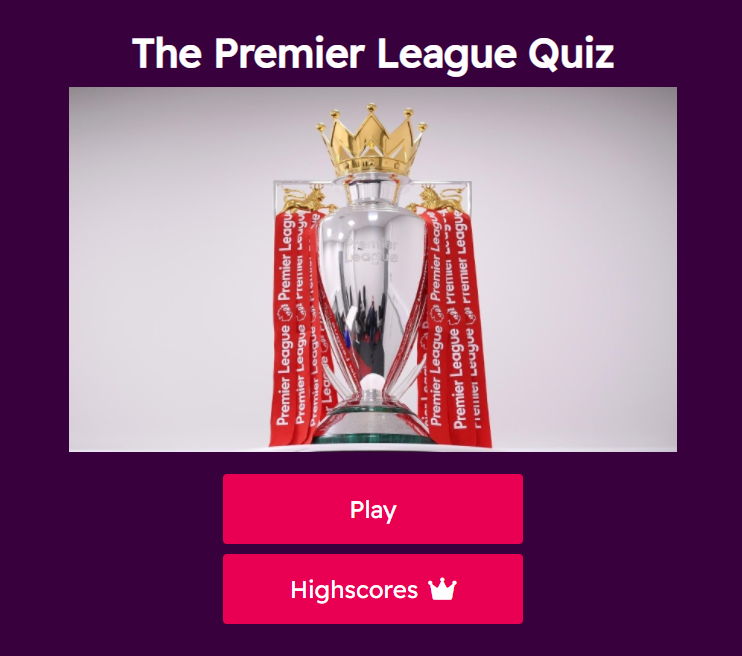

# **_Premier Leage Quiz_**

The premier League quiz is a quiz I made for people who share my passion for football, and the Premier League in particular. The quiz is easy to use and fun.

Welcome to the process behind <a href="https://joeyo991.github.io/" target="_blank" rel="noopener">The Premier League Quiz</a>

# User Experience

## Site Structure

The Premier League Quiz website is a single page with a quiz in the shape of a form for the user to complete.

## Design Choices

 * ### Typography
     The chosen font for the page was 'Readex Pro'. This font was chosen because it is easy to read, it is stylish, and because it is very similar to the official Premier League font.

 * ### Colour Scheme
     The colour scheme chosen for the page was based on the Official Premier League colour scheme for the 2021/2022 season. It features white, a pink (Amaranth) and a purple (Russian Violet).

# Features

The Premier League Quiz is set up to be striking and easy on the eyes. It is immediately recognizable to football fans because of the colours and fonts used throughout.

## Existing Features
* ### Home Page

    * The first page of the site is the Home Page.
    * The text, colours and image let the user know immediately what the page is.
    * The play button allows the user to start the quiz.
    * The Highscores button takes the user to the leaderboard.

* ### The Quiz
    * The quiz is made up of 10 questions with varying difficulty, depending on the user's knowledge of the Premier League.
    * Each question has 4 possible asnwers.
    * Only one of the choices can be picked per question.
    * Each question also has a corresponding image that may or may not be a clue to the answer.
    * Every question appears on its own, and the next question is revealed when the user selects their choice for the current question.
    * If the user selects a correct answer, it will flash green. If they select a wrong answer, it will flash red.

* ### Progress Bar
    * The progress bar is located at the top of the quiz and shows the user what question they are on.
    * It fills as they progress through the quiz.
    * Along side the progress bar is the user's score
    * This lets the user know how many questions they have gotten right so far.

